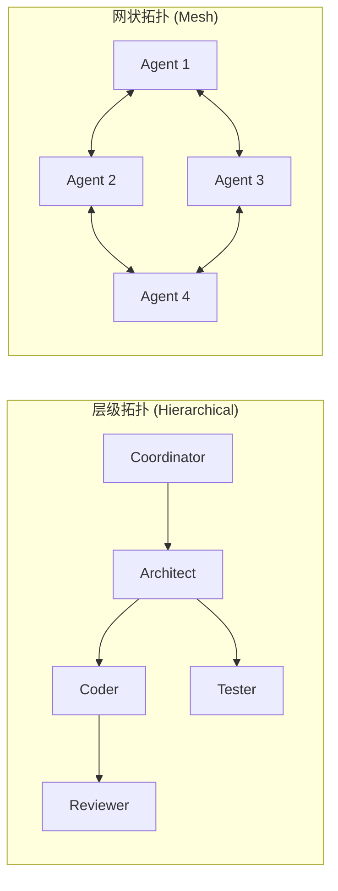
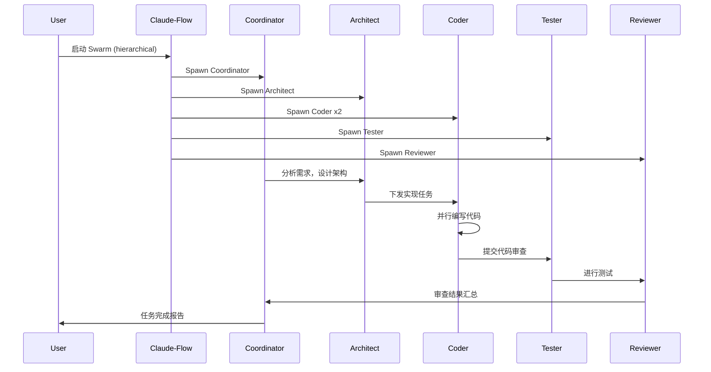
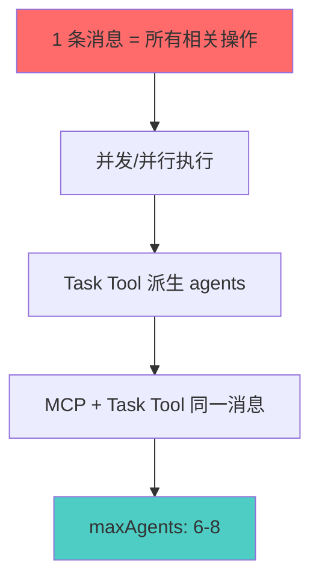
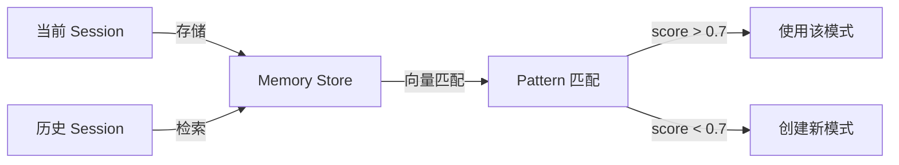
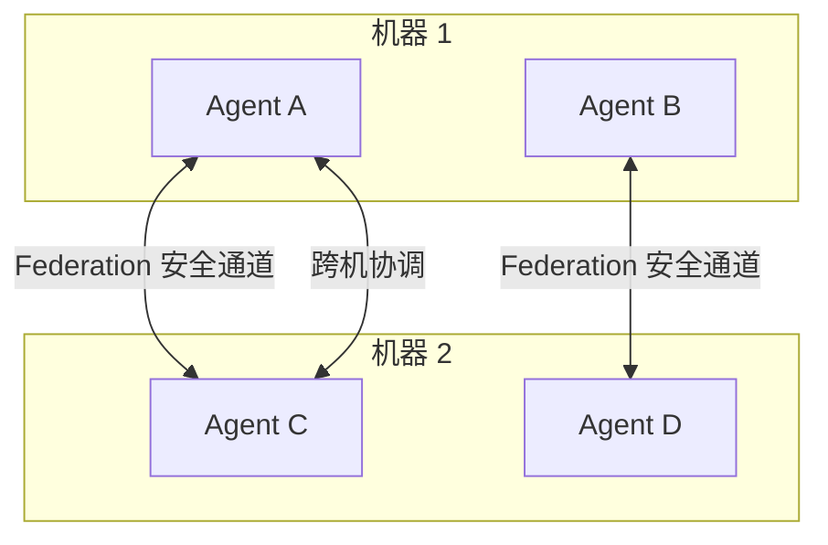
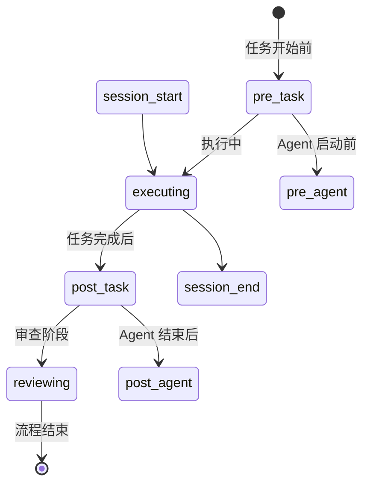
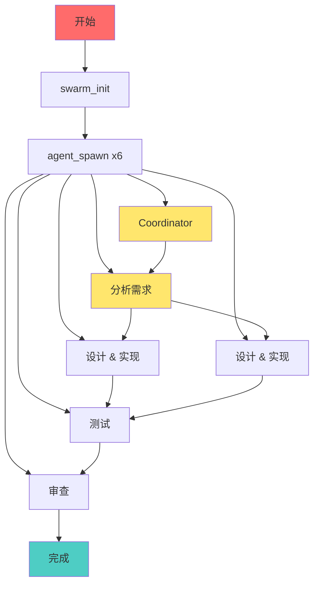

# Agent 系统文档

> **Ruflo Agent 核心架构** | 基于 Claude Flow V3

---

## 📊 核心数字

| 指标 | 数值 |
|------|------|
| MCP Tools | 314 个 |
| CLI 命令 | 60+ 个 |
| Skills | 30 个 |
| AgentDB Controllers | 19 个 |
| Native Plugins | 21 个 |

---

## 🤖 Agent 类型（16种 + Custom）

### 核心类型

| 类型 | 用途 | 场景 |
|------|------|------|
| `coordinator` | 编排其他 agents | 多 agent 协调任务 |
| `coder` | 编写代码 | 功能实现 |
| `tester` | 编写测试 | 单元测试、集成测试 |
| `reviewer` | 审查代码 | Code Review |
| `architect` | 系统设计 | 架构规划 |
| `researcher` | 分析需求 | 需求调研 |
| `security-architect` | 安全设计 | 安全审计 |
| `performance-engineer` | 性能优化 | 性能调优 |

### 专用类型

| 类型 | 用途 |
|------|------|
| `security-auditor` | 安全审计 |
| `memory-specialist` | 记忆管理 |
| `hierarchical-coordinator` | 层级协调 |
| `mesh-coordinator` | 网状协调 |
| `adaptive-coordinator` | 自适应协调 |
| `byzantine-coordinator` | 拜占庭共识 |
| `raft-manager` | Raft 管理 |
| `gossip-coordinator` | Gossip 协议 |

---

## 🔄 Swarm 协作架构

Swarm 是多 Agent 协作的基本单元，支持多种拓扑结构。

### 拓扑类型



| 拓扑 | 适用场景 | 特点 |
|------|----------|------|
| `hierarchical` | 团队协作、防漂移 | 上下级管理 |
| `mesh` | 对等协作 | 无中心 |
| `hierarchical-mesh` | 混合模式（V3 推荐） | 兼顾两者 |
| `ring` | 顺序处理 | 流水线 |
| `star` | 中心辐射 | 单点协调 |
| `adaptive` | 动态切换 | 智能拓扑 |

---

## 🔗 协作流程

### 典型开发流程



### 消息处理规则



---

## 💾 Memory 持久化记忆

跨 session 的持久化记忆系统，支持向量搜索。



### Memory 工作流

```
1. BEFORE: memory_search(query="任务关键词")
   → 找到相似模式 (score > 0.7 则使用)

2. COORDINATE: swarm_init(topology="hierarchical")

3. EXECUTE: 实际编写代码/执行命令

4. AFTER: memory_store(key="pattern-x", value="成功经验")
```

---

## 🌐 Federation 跨机器通信

安全的跨机器 Agent 通信机制。



---

## 🪝 Hooks 生命周期钩子（17种）



| Hook 类型 | 触发时机 |
|-----------|----------|
| `pre-task` | 任务开始前 |
| `post-task` | 任务完成后 |
| `pre-agent` | Agent 启动前 |
| `post-agent` | Agent 结束后 |
| `session-start` | Session 开始 |
| `session-end` | Session 结束 |
| `route` | 路由决策 |
| `worker-dispatch` | Worker 调度 |

---

## 📋 CLI 命令参考

### Swarm 命令

```bash
# 初始化 Swarm
npx claude-flow swarm init --topology hierarchical --max-agents 8

# 启动任务
npx claude-flow swarm start --objective "任务描述" --strategy development

# 查看状态
npx claude-flow swarm status

# 停止 Swarm
npx claude-flow swarm stop
```

### Agent 命令

```bash
# 派生 Agent
npx claude-flow agent spawn --type coder --name coder-1

# 列出 Agents
npx claude-flow agent list

# 查看状态
npx claude-flow agent status AGENT_ID

# 停止 Agent
npx claude-flow agent stop AGENT_ID
```

### Memory 命令

```bash
# 存储
npx claude-flow memory store --key "pattern-x" --value "成功经验" --namespace patterns

# 搜索
npx claude-flow memory search --query "任务关键词"

# 检索
npx claude-flow memory retrieve --key "pattern-x"
```

---

## 🛠️ MCP Tools（314个）

### 协调类

| Tool | 用途 |
|------|------|
| `swarm_init` | 初始化 Swarm |
| `swarm_status` | 查看 Swarm 状态 |
| `agent_spawn` | 注册 Agent 角色 |
| `agent_status` | 查看 Agent 状态 |
| `task_orchestrate` | 多 Agent 任务协调 |

### 记忆类

| Tool | 用途 |
|------|------|
| `memory_search` | 向量搜索 |
| `memory_store` | 存储模式 |
| `memory_retrieve` | 精确检索 |
| `neural_train` | 模式训练 |
| `neural_status` | 学习状态 |

### Hive Mind（高级）

| Tool | 用途 |
|------|------|
| `hive-mind_init` | 拜占庭共识初始化 |
| `hive-mind_spawn` | 派生 Hive Workers |
| `hive-mind_broadcast` | 广播消息 |

---

## 📦 Skills（30个）

| Skill | 用途 |
|-------|------|
| `$swarm-orchestration` | 多 Agent 协调 |
| `$memory-management` | 记忆存储/检索 |
| `$sparc-methodology` | 结构化开发 |
| `$security-audit` | 安全扫描 |
| `$performance-analysis` | 性能分析 |
| `$github-automation` | CI/CD 管理 |
| `$hive-mind` | 拜占庭共识 |
| `$neural-training` | 模式学习 |

---

## ⚙️ 默认配置

| 配置项 | 默认值 |
|--------|--------|
| Topology | `hierarchical` |
| Max Agents | 8 |
| Strategy | `specialized` |
| Consensus | `raft` |
| Memory | `hybrid` |

---

## 🚀 快速开始

### 5-Agent 开发团队

```bash
npx claude-flow swarm init --topology hierarchical --max-agents 8
npx claude-flow agent spawn --type coordinator --name coord-1
npx claude-flow agent spawn --type architect --name arch-1
npx claude-flow agent spawn --type coder --name coder-1
npx claude-flow agent spawn --type coder --name coder-2
npx claude-flow agent spawn --type tester --name tester-1
npx claude-flow agent spawn --type reviewer --name reviewer-1
npx claude-flow swarm start --objective "实现新功能" --strategy development
```

### Bug 修复团队（4 Agents）

```bash
npx claude-flow swarm init --topology hierarchical --max-agents 4
npx claude-flow agent spawn --type coordinator --name lead
npx claude-flow agent spawn --type researcher --name debug
npx claude-flow agent spawn --type coder --name fix
npx claude-flow agent spawn --type tester --name verify
npx claude-flow swarm start --objective "修复 Bug" --strategy development
```

### 安全审计团队（3 Agents）

```bash
npx claude-flow swarm init --topology hierarchical --max-agents 4
npx claude-flow agent spawn --type coordinator --name lead
npx claude-flow agent spawn --type security-architect --name audit
npx claude-flow agent spawn --type reviewer --name review
npx claude-flow swarm start --objective "安全审计" --strategy development
```

---

## 📐 Agent 协作拓扑图

### 完整功能开发流程



---
