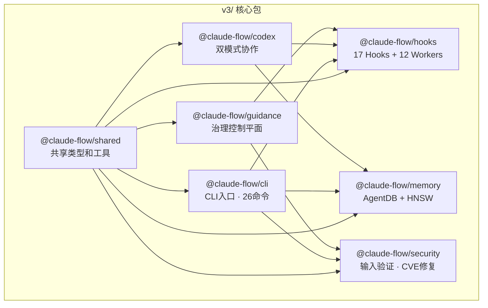
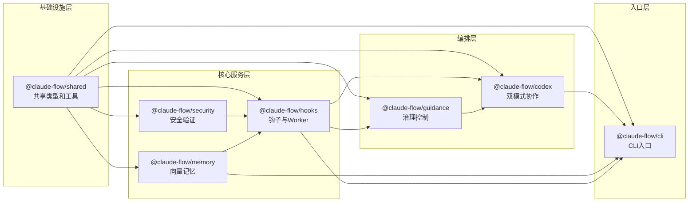
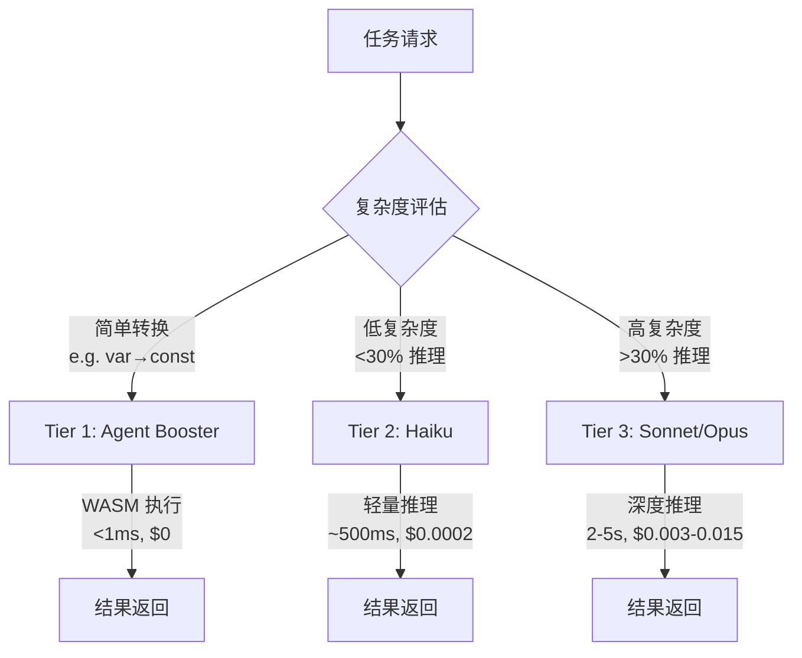
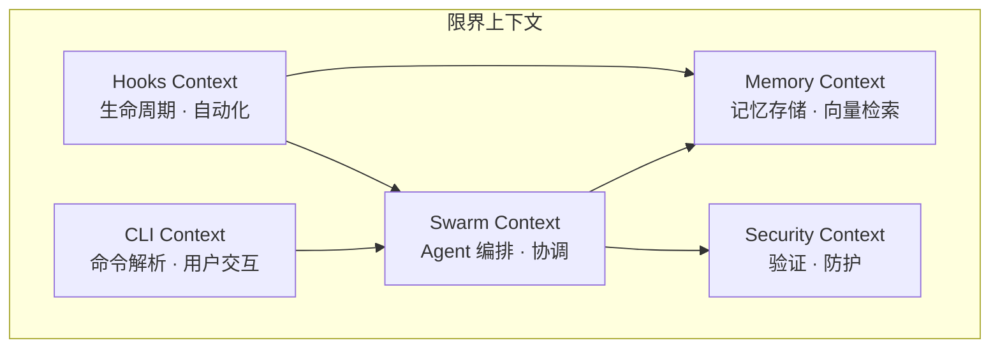
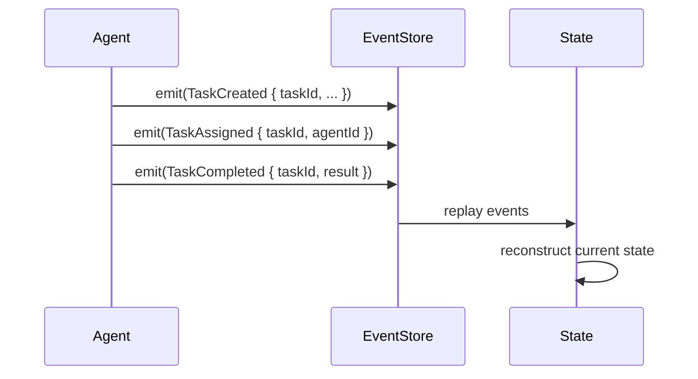

# Ruflo 架构文档

> 版本: v3.6 | 更新日期: 2026-04-29

---

## 1. Overview — Ruflo定位和核心价值

Ruflo 是一个**智能体编排框架**，旨在实现 Claude Code 与 OpenAI Codex 的双模式协作。通过分层模型路由和事件溯源架构，为 AI 原生开发提供高效、可观测的协同平台。

### 核心价值

| 价值主张 | 描述 |
|---------|------|
| **双模式协作** | 同时利用 Claude 的深度推理和 Codex 的快速代码生成能力 |
| **智能路由** | 基于任务复杂度自动选择最优模型（ADR-026） |
| **向量记忆** | HNSW 索引实现 150x-12,500x 加速的记忆检索 |
| **自学习能力** | 17 个 Hooks + 12 个 Workers 实现模式学习和优化 |

### 技术指标

- **6,000+** commits
- **314** MCP tools
- **16** agent roles + 自定义类型
- **19** AgentDB controllers
- **21** native plugins
- **26** CLI commands (140+ subcommands)

---

## 2. 核心包 — 7个核心包的职责和关系

### 2.1 核心包概览



### 2.2 包职责详解

| 包名 | 路径 | 职责 | 关键能力 |
|------|------|------|---------|
| `@claude-flow/cli` | `v3/@claude-flow/cli/` | CLI 入口点，提供 26 个命令 | swarm 编排、agent 管理、task 调度 |
| `@claude-flow/codex` | `v3/@claude-flow/codex/` | 双模式 Claude + Codex 协作 | DualModeOrchestrator、跨平台学习 |
| `@claude-flow/guidance` | `v3/@claude-flow/guidance/` | 治理控制平面 | WASM 加速器、策略执行 |
| `@claude-flow/hooks` | `v3/@claude-flow/hooks/` | 生命周期钩子和后台 Worker | 17 hooks + 12 workers、自学习 |
| `@claude-flow/memory` | `v3/@claude-flow/memory/` | AgentDB + HNSW 向量搜索 | 150x-12,500x 检索加速、混合存储 |
| `@claude-flow/security` | `v3/@claude-flow/security/` | 输入验证和 CVE 修复 | InputValidator、PathValidator、SafeExecutor |
| `@claude-flow/shared` | `v3/@claude-flow/shared/` | 共享类型定义和工具函数 | 类型安全、通用工具 |

### 2.3 包依赖关系



---

## 3. 3-Tier 模型路由 — ADR-026决策

### 3.1 路由决策概述

ADR-026 定义了**三层智能路由模型**，根据任务复杂度自动选择最优处理路径：



### 3.2 三层模型对比

| 层级 | 处理器 | 延迟 | 成本 | 适用场景 | 示例 |
|------|--------|------|------|---------|------|
| **Tier 1** | Agent Booster (WASM) | <1ms | $0 | 简单转换，**跳过 LLM** | `var→const`, `add-types`, `async-await` |
| **Tier 2** | Haiku | ~500ms | $0.0002 | 低复杂度任务 (<30%) | 格式化、简单重构、基础搜索 |
| **Tier 3** | Sonnet/Opus | 2-5s | $0.003-0.015 | 复杂推理 (>30%) | 架构设计、安全分析、多步推理 |

### 3.3 复杂度判断标准

```typescript
interface ComplexityAssessment {
  // Token 密集度
  tokenDensity: 'low' | 'medium' | 'high';

  // 推理深度需求
  reasoningDepth: 'none' | 'shallow' | 'deep';

  // 跨文件关联度
  fileCoupling: 'isolated' | 'moderate' | 'tight';

  // 安全敏感度
  securitySensitivity: 'none' | 'low' | 'high';
}

// 复杂度计算
function calculateComplexity(task: Task): number {
  // 返回 0-100 的复杂度分数
  // < 30: Tier 2 (Haiku)
  // >= 30: Tier 3 (Sonnet/Opus)
}
```

### 3.4 Tier 1: Agent Booster 意图类型

当检测到以下意图类型时，WASM Booster 直接处理，**零延迟零成本**：

| 意图类型 | 转换示例 |
|---------|---------|
| `var-to-const` | `var x = 1` → `const x = 1` |
| `add-types` | 添加 TypeScript 类型注解 |
| `add-error-handling` | 添加 try-catch 块 |
| `async-await` | Promise → async/await |
| `add-logging` | 添加 console.log 包装 |
| `remove-console` | 清除调试日志 |

### 3.5 路由决策信号

系统在 `pre-task` Hook 中发出路由信号：

```
[AGENT_BOOSTER_AVAILABLE]     # Tier 1 可用
[TASK_MODEL_RECOMMENDATION]     # Tier 2/3 推荐
[COMPLEXITY_SCORE: 0-100]       # 复杂度分数
```

---

## 4. 设计原则

### 4.1 Domain-Driven Design (DDD)

Ruflo 采用**限界上下文 (Bounded Contexts)** 划分架构：



**限界上下文映射**：

| 上下文 | 核心实体 | 领域服务 |
|-------|---------|---------|
| CLI | Command, Option | CommandParser, ConfigLoader |
| Swarm | Agent, Task, Message | AgentCoordinator, TaskScheduler |
| Memory | MemoryEntry, VectorIndex | VectorStore, HNSWIndex |
| Security | Validator, Policy | InputValidator, PathValidator |
| Hooks | Hook, Worker, Signal | HookExecutor, WorkerPool |

### 4.2 文件规范

- **文件行数限制**: < 500 行
- **类型接口**: 所有公开 API 必须使用 Typed interfaces
- **单一职责**: 每个文件专注于一个领域概念

```typescript
// ✅ 正确的类型定义
interface Agent {
  id: string;
  type: AgentType;
  status: AgentStatus;
  createdAt: Date;
}

// ✅ 错误的做法：类型散落各处，无统一接口
// const agent = { id: '1', name: 'test' } // 缺少类型约束
```

### 4.3 Event Sourcing (事件溯源)

状态变更通过**不可变事件**记录，支持完整的历史回溯和重放：



**核心事件类型**：

| 事件 | 描述 | 触发时机 |
|------|------|---------|
| `AgentSpawned` | Agent 创建 | `agent spawn` |
| `TaskCreated` | 任务创建 | `task create` |
| `TaskAssigned` | 任务分配 | `task assign` |
| `TaskCompleted` | 任务完成 | 任务成功结束 |
| `MemoryStored` | 记忆存储 | `memory store` |
| `HookTriggered` | Hook 触发 | 生命周期事件 |

### 4.4 TDD London School (Mock-First)

采用**伦敦学派 TDD** — 先通过 Mock 验证交互，再实现具体逻辑：

```typescript
// Step 1: 定义接口 (Specification)
describe('AgentCoordinator', () => {
  it('should assign task to available agent', async () => {
    // Step 2: 创建 Mock
    const mockAgentPool = {
      getAvailable: jest.fn().mockResolvedValue(agent),
      release: jest.fn()
    };

    const coordinator = new AgentCoordinator(mockAgentPool);

    // Step 3: 验证交互
    await coordinator.assignTask(task);

    expect(mockAgentPool.getAvailable).toHaveBeenCalledWith(task.type);
    expect(mockAgentPool.release).toHaveBeenCalledWith(agent.id);
  });
});

// Step 4: 实现 (在测试通过后)
class AgentCoordinator {
  constructor(private agentPool: IAgentPool) {}

  async assignTask(task: Task): Promise<void> {
    const agent = await this.agentPool.getAvailable(task.type);
    // ... 实现逻辑
    this.agentPool.release(agent.id);
  }
}
```

**Mock 优先原则**：

1. **交互验证**: 验证组件间的消息传递，而非状态
2. **隔离测试**: Mock 外部依赖，确保单元测试纯粹性
3. **行为驱动**: 从用例出发，设计接口而非实现

---

## 附录

### A. 项目结构

```
/home/hermes/opensource/ruflo/
├── v3/
│   ├── @claude-flow/
│   │   ├── cli/              # CLI 入口
│   │   ├── codex/            # 双模式协作
│   │   ├── guidance/         # 治理控制
│   │   ├── hooks/            # 生命周期钩子
│   │   ├── memory/           # 向量记忆
│   │   ├── security/         # 安全验证
│   │   └── shared/           # 共享类型
│   └── plugins/              # 插件系统
├── docs/
│   └── USERGUIDE.md          # 用户指南
└── verification/
    └── inventory.json       # 工具清单
```

### B. ADR 索引

| ADR | 标题 | 状态 |
|-----|------|------|
| ADR-006 | Unified Memory Service with AgentDB | ✅ |
| ADR-008 | Vitest testing framework | ✅ |
| ADR-009 | Hybrid Memory Backend (SQLite + HNSW) | ✅ |
| ADR-026 | Intelligent 3-tier model routing | ✅ |
| ADR-048 | Auto Memory Bridge | ✅ |
| ADR-049 | Self-Learning Memory with GNN | ✅ |
