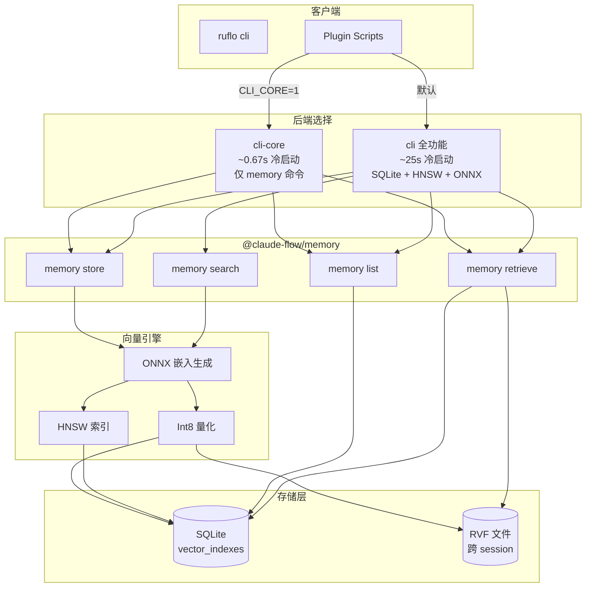
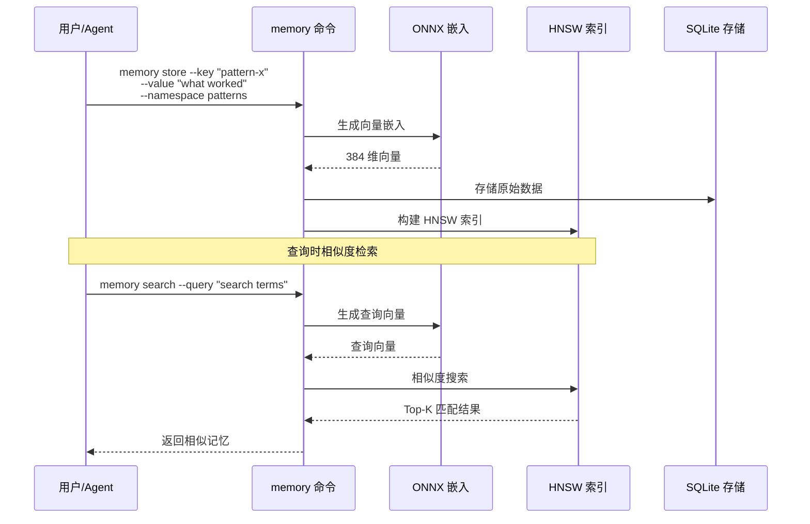

# Memory 系统 (AgentDB)

Ruflo 的 Memory 系统基于 **AgentDB** 构建，提供高性能的向量搜索和持久化存储能力。

## 核心特性

| 特性 | 性能提升 | 状态 |
|------|---------|------|
| HNSW 向量搜索 | 150x-12,500x 加速 | ✅ 已实现 |
| Int8 量化 | 50-75% 内存减少 (3.92x) | ✅ 已实现 |
| RVF 持久化 | 跨 session 存储 | ✅ 已实现 |
| ONNX 嵌入 | 384 维 all-MiniLM-L6-v2 | ✅ 已实现 |

## 架构概览



## 向量搜索工作流



## Memory 命令

### 基本操作

```bash
# 存储记忆
ruflo memory store --key "pattern-x" --value "what worked" --namespace patterns

# 语义搜索
ruflo memory search --query "search terms"

# 列出命名空间
ruflo memory list --namespace patterns

# 精确检索
ruflo memory retrieve --key "key"
```

### 完整命令列表

| 命令 | 说明 |
|------|------|
| `memory store` | 存储键值对到 AgentDB |
| `memory search` | 基于向量相似度的语义搜索 |
| `memory list` | 列出命名空间下的所有记忆 |
| `memory retrieve` | 通过键精确检索记忆 |
| `memory init` | 初始化 RVF 后端 |
| `memory delete` | 删除指定记忆 |

## cli-core vs cli

| 特性 | cli-core | cli (全功能) |
|------|----------|-------------|
| 冷启动时间 | ~0.67s (671ms) | ~25s |
| 打包大小 | 22.3 KB | 1.8 MB |
| 文件数量 | 22 | 999 |
| SQLite 支持 | ❌ | ✅ |
| HNSW 搜索 | ❌ | ✅ |
| ONNX 嵌入 | ❌ | ✅ |
| memory 命令 | ✅ | ✅ |

### Plugin Scripts 切换

Plugin scripts 可通过设置环境变量 `CLI_CORE=1` 切换到轻量级路径：

```javascript
const cliPkg = process.env.CLI_CORE === '1'
  ? '@claude-flow/cli-core@alpha'  // ~1.5s 冷缓存
  : '@claude-flow/cli'              // ~35s 冷缓存
```

### 性能对比

```
cli-core vs cli 冷启动对比:
├── cli-core: 671ms (22.3 KB, 22 文件)
└── cli:      25,496ms (1.8 MB, 999 文件)
    └── 提升: 38× 加速, 80× 体积缩小
```

## RVF (Ruflo Vector Format)

RVF 是 Ruflo 的向量格式标准，支持跨 session 持久化：

- **二进制格式**：高效的向量存储
- **跨会话**：重启后数据不丢失
- **双向迁移**：JSON ↔ RVF, SQLite ↔ RVF

```bash
# 初始化 RVF 后端
ruflo memory init --force

# 验证存储
ruflo memory store --key "rvf-test" --value "RVF binary format" --namespace rvf-verify
ruflo memory retrieve --key "rvf-test" --namespace rvf-verify
```

## 技术栈

- **@claude-flow/memory**: 核心 Memory 包
- **sql.js**: 跨平台 SQLite (WASM，无原生编译)
- **ONNX Runtime**: 向量嵌入计算
- **HNSW**: 近似最近邻搜索算法
- **Int8 量化**: 内存优化 (3.92x 压缩率)

## MCP 工具

Memory 系统通过 MCP (Model Context Protocol) 暴露以下工具：

| 工具 | 功能 |
|------|------|
| `memory_search` | 语义搜索记忆 |
| `memory_store` | 存储新记忆 |
| `memory_retrieve` | 精确键检索 |
| `memory_list` | 列出命名空间 |
| `memory_delete` | 删除记忆 |
| `memory_import_claude` | 导入 Claude Code 记忆 |

---

*AgentDB + HNSW: 150x-12,500x faster pattern search*
