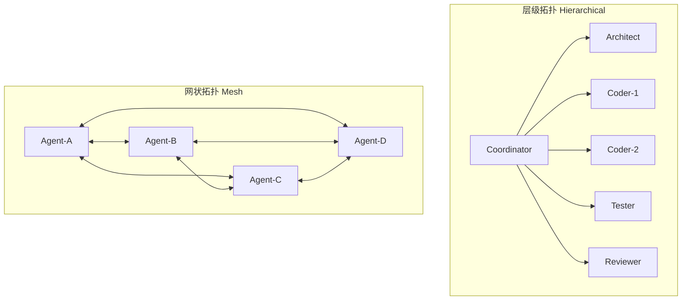
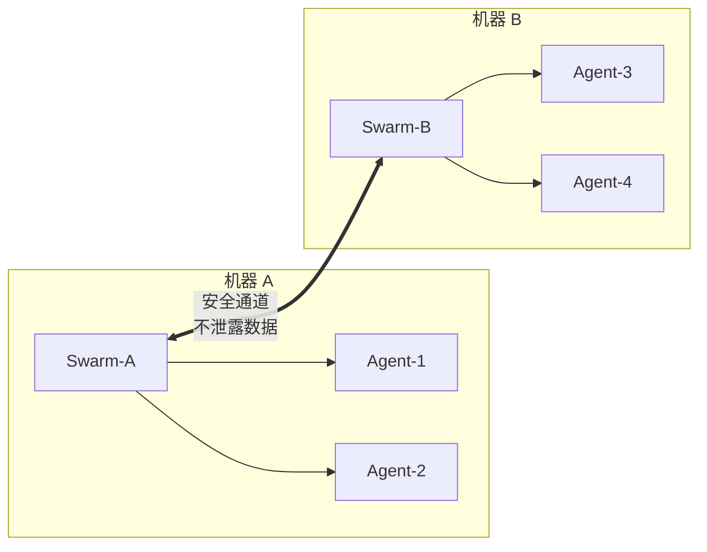

# Swarm — 多 Agent 协作单元

> Swarm 是 Ruflo 的多 Agent 协作框架，通过拓扑结构、共识机制和抗 drift 策略实现大规模 Agent 团队的高效协同。

## 核心概念

Swarm 由以下组件构成：

- **Swarm Init**：初始化协调记录（立即返回，不阻塞）
- **Agent Spawn**：生成各类型 Agent（coordinator、coder、tester 等）
- **Hive-Mind Consensus**：维护团队状态一致性
- **Worktree Isolation**：每个 Agent 在独立 git worktree 中工作，避免冲突

## 拓扑类型

Swarm 支持多种拓扑结构，适应不同任务场景：

| 拓扑 | 描述 | 适用场景 | maxAgents |
|------|------|----------|-----------|
| `hierarchical` | 层级拓扑，coordinator 居中协调 | 开发任务 | 6-8 |
| `mesh` | 网状拓扑，Agent 全连接 | 研究任务 | 5-10 |
| `hierarchical-mesh` | 混合拓扑（queen + 对等通信） | 大型团队 | 10+ |
| `ring` | 环形拓扑 | 流水线任务 | 4-8 |
| `star` | 星形拓扑，中心节点居中 | 简单任务 | 3-6 |
| `adaptive` | 自适应拓扑 | 动态任务 | 灵活 |

### 拓扑示意图



## 抗 Drift 机制（Anti-Drift）

Agent 在长时间运行中容易"漂移"（偏离目标或产生不一致状态）。Ruflo 实现了多层抗 drift 机制：

| 机制 | 描述 |
|------|------|
| **frequent checkpoints** | 通过 post-task hooks 频繁保存状态 |
| **shared memory namespace** | 所有 Agent 共享 `swarm-state` 命名空间 |
| **raft consensus** | leader 维护权威状态，副本同步 |
| **short task cycles + verification gates** | 短周期任务配合验证关卡 |
| **specialized strategy** | 清晰角色边界，避免职责重叠 |

### Anti-Drift 默认配置（开发 Swarm 推荐）

```yaml
topology: hierarchical    # Coordinator 捕获偏差
maxAgents: 6-8           # 小团队减少漂移
strategy: specialized    # 角色清晰，无重叠
consensus: raft          # Leader 维护权威状态
memory: hybrid           # SQLite + AgentDB
```

## Strategy 类型

| Strategy | 适用场景 | 特点 |
|----------|----------|------|
| `specialized` | 开发任务 | 清晰角色边界，无职责重叠 |
| `development` | 编码实现 | 注重代码质量和进度 |
| `research` | 调研分析 | 深入探索，多路径尝试 |
| `testing` | 测试验证 | 覆盖度优先 |

## Agent 类型

| Type | 用途 |
|------|------|
| `coordinator` | 协调其他 Agent，分解任务 |
| `coder` | 编写代码 |
| `tester` | 编写测试 |
| `reviewer` | 代码审查 |
| `architect` | 系统设计 |
| `researcher` | 需求分析 |
| `security-architect` | 安全设计 |
| `performance-engineer` | 性能优化 |

## 共识机制（Hive-Mind Consensus）

Ruflo 支持多种共识策略：

| 策略 | 描述 | 适用场景 |
|------|------|----------|
| `raft` | Leader-based 共识，简洁高效 | 多数场景 |
| `byzantine` | 拜占庭容错 | 高可靠性需求 |
| `gossip` | 最终一致性 | 大规模分布式 |
| `crdt` | 无冲突复制数据类型 | 并发写入 |
| `quorum` | 多数投票 | 强一致性 |

## Federation（跨机器协作）

Swarm 支持跨信任边界的分布式协作：



**安全特性**：
- 跨信任边界安全通信
- 数据不泄露
- 独立 Swarm 状态管理

## 关键命令

### 初始化 Swarm

```bash
# 初始化层级 Swarm（开发任务推荐）
npx claude-flow swarm init --topology hierarchical --max-agents 8

# 初始化网状 Swarm（研究任务）
npx claude-flow swarm init --topology mesh --max-agents 5

# V3 模式（支持 15 个 Agent）
npx claude-flow swarm init --v3-mode
```

### 部署 Agent

```bash
# 生成各类型 Agent
npx claude-flow agent spawn --type coordinator --name coord-1
npx claude-flow agent spawn --type coder --name coder-1
npx claude-flow agent spawn --type coder --name coder-2
npx claude-flow agent spawn --type tester --name tester-1
npx claude-flow agent spawn --type reviewer --name reviewer-1
npx claude-flow agent spawn --type architect --name arch-1
```

### 启动任务

```bash
# 启动 Swarm（立即执行，claude-flow 仅追踪状态）
npx claude-flow swarm start --objective "Your task here" --strategy development
```

### Swarm 管理

```bash
# 查看状态
npx claude-flow swarm status

# 查看健康状态
npx claude-flow swarm health

# 关闭 Swarm
npx claude-flow swarm shutdown

# 列出所有 Agent
npx claude-flow agent list

# 查看 Agent 状态
npx claude-flow agent status <agent-name>
```

## MCP 工具（12 个）

### Swarm 工具（4 个）

| 工具 | 用途 |
|------|------|
| `swarm_init` | 初始化 Swarm |
| `swarm_status` | 查看状态 |
| `swarm_shutdown` | 关闭 Swarm |
| `swarm_health` | 健康检查 |

### Agent 工具（8 个）

| 工具 | 用途 |
|------|------|
| `agent_spawn` | 生成 Agent |
| `agent_execute` | 执行命令 |
| `agent_terminate` | 终止 Agent |
| `agent_status` | Agent 状态 |
| `agent_list` | 列出所有 Agent |
| `agent_pool` | Agent 池管理 |
| `agent_health` | Agent 健康检查 |
| `agent_update` | 更新 Agent |

## 完整示例

```bash
# Step 1: 初始化协调记录（立即返回）
npx claude-flow swarm init --topology hierarchical --max-agents 8

# Step 2: 生成 Agent
npx claude-flow agent spawn --type coordinator --name coord-1
npx claude-flow agent spawn --type coder --name coder-1
npx claude-flow agent spawn --type tester --name tester-1

# Step 3: 启动任务（继续执行工作，claude-flow 仅追踪）
npx claude-flow swarm start --objective "Build REST API" --strategy development

# Step 4: 执行实际工作
# ... 你的代码工作 ...

# Step 5: 报告结果
npx claude-flow memory store --key "result" --value "API built successfully" --namespace results
```

**重要**：调用 claude-flow 命令后立即继续工作，它仅创建协调记录，不执行实际任务。

## Namespace 协调

Swarm 使用 `swarm-state` AgentDB 命名空间存储：

- 活跃 Swarm 信息
- Agent 分配记录
- 拓扑快照

## 相关文档

- [AGENTS.md](https://github.com/ruvnet/ruflo/blob/main/AGENTS.md) — Agent 完整指南
- [ruflo-swarm 插件](https://github.com/ruvnet/ruflo/tree/main/plugins/ruflo-swarm) — Swarm 插件源码
- [V3 Agent Specifications](https://github.com/ruvnet/ruflo/blob/main/v3/implementation/swarm-plans/AGENT-SPECIFICATIONS.md) — 15-Agent Swarm 详细配置
